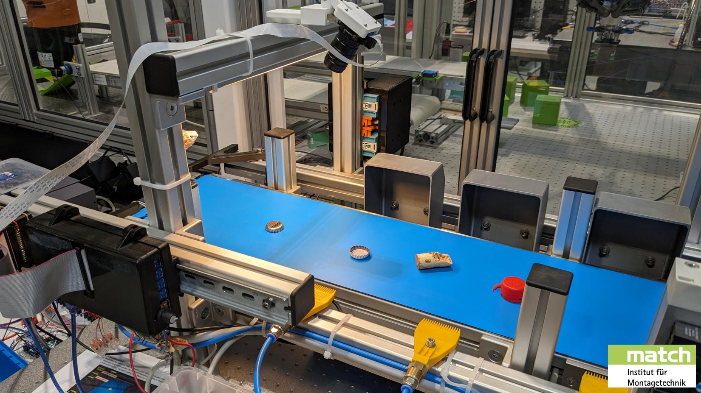
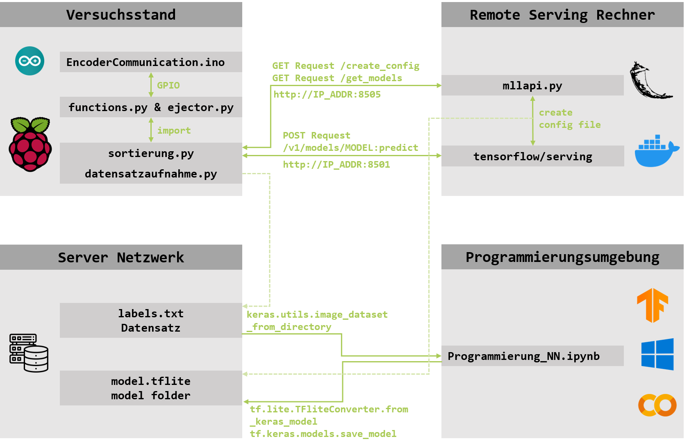

# &nbsp; Masterlabor: Maschinelles Lernen in der Produktionstechnik



Sammlung aller Programme und Komponenten, welche für das [Masterlabor: Maschinelles Lernern in der Produktionstechnik](https://www.match.uni-hannover.de/de/studium/lehrveranstaltungen/masterlabor-maschinelles-lernen-in-der-produktionstechnik) am [Insitut für Montagetechnik (match)](https://www.match.uni-hannover.de/) der [Universtität Hannover (LUH)](https://www.uni-hannover.de/) genutzt werden.

## Tutorial
<p align="center"><a target="_blank" href="https://colab.research.google.com/github/match-Education/match-MLL/blob/main/Programmierung/Tutorial_Skript_Programmierung_NN.ipynb">
  
</a></p>

Zur Vorbereitung auf das Labor, soll zunächst das Tutorial [`Tutorial_Skript_Programmierung_NN.ipynb`](/Programmierung/Tutorial_Skript_Programmierung_NN.ipynb) berarbeitet werden. Dies kann auch direkt auf Google Colab geöffnet werden.

Alle weiteren Informationen können dem Skript für die Veranstaltung entnommen werden.

## Programmierung
<p align="center"><a target="_blank" href="https://colab.research.google.com/github/match-Education/match-MLL/blob/main/Programmierung/Vorlage_Programmierung_NN.ipynb">
  
</a></p>

Zur weiteren Vorbereitung auf den Versuch, ist es ebenso möglich, die [`Vorlage_Programmierung_NN.ipynb`](/Programmierung/Vorlage_Programmierung_NN.ipynb) für Prorammierung bereits in Colab oder auf dem lokalen System zu nutzen.

Auch hierfür ist das Skript der Veranstaltung für weitere Hinweise zu beachten.


### Verwendung von Keras Applications

Zum Vergleich verschiedener State of the Art Modelle, können [Keras Applications](https://keras.io/api/applications/) verwendet werden. Die ermöglichen es, eine Vielzahl unterschiedlicher Machine Learning Modelle schnell und einfach zu nutzen.

Die Verwendung ist in der Keras Dokumentation beschrieben. Es Gilt zu beachten, dass die Modelle eine jeweils spezifische Eingabegröße erwarten. Somit ist es gegenfalls notwendig, die Bilder des Datensatzes entsprechend zu resizen. Die gewünschten Dimensionne können mit Hilfe der `model.summary()` ermittelt werden:

```
Model: "resnet101v2"
__________________________________________________________________________________________________
 Layer (type)                Output Shape                 Param #   Connected to                  
==================================================================================================
 input_1 (InputLayer)        [(None, 224, 224, 3)]        0         []                            
```
Beispiel: Die Output Shape der Input Layer von ResNet101v2 entspricht den Datendimensionen, welche das Modell erwartet. Also 224x224 Pixel bei 3 Farbkanälen. Im Falle von Graustufen Bildern, ist es also dennoch notwendig, drei gleiche Kanäle an das Modell zu übergeben.

## Versuchsstand

Die folgende Dokumenation richtet sich primär an die Betreur*innen des Labors. Sie kann jedoch auch für die persönliche Verwendung genutzt werden, etwa bei der vertiefenden wissenschaftlichen Arbeit mit künstlichen neuronalen Netzen.

Der systematische Aufbau des Versuchsstandes ist in der der folgenden Abbildung dargestellt:



### Remote Serving

Es existieren viele untetrschiedliche Möglichkeiten um fertig trainierte Modelle im produktiven Betrieb zu nutzen. Häufig werden hierzu Services wie etwa [Amazon SageMaker](https://aws.amazon.com/de/sagemaker/) genutzt.

[TensorFlow Serving](https://github.com/tensorflow/serving) bietet eine weitere Möglichkeit Machine Learning Modelle mit relativ geringem Aufwand auf einer Vielzahl unterschiedlichster System zu deployen. Im Rahmen des MLL wird TensorFlow Serving verwendet um die trainierten Netze auf einem leistungsstarken Computer zur Verfügung zu stellen. Mit Hilfe der bereitgestellten [RestAPI](https://www.tensorflow.org/tfx/serving/api_rest) können Anfragen für die Objekterkennung vom Raspberry Pi aus gemacht werden.

#### Anlegen der .credentials Datei
Um die [`mountshare.sh`](/Steuerung_Versuchsstand/Serving/mountshare.sh), [`launchcontainer.sh`](/Steuerung_Versuchsstand/Serving/launchcontainer.sh) und [`mllapi.py`](/Steuerung_Versuchsstand/Serving/mllapi.py) Skripte nutzen zu können, ist die Datei `.credentials` erforderlich und muss im selten Ordner wie die Skripte liegen. Da diese Datei sensitve Daten beinhaltet, muss diese händisch aus der Datei [`.credentials_template`](/Steuerung_Versuchsstand/Serving/.credentials_template) erstellt werden:

```bash
# .credentials - CIFS Mount Configuration

# CIFS server address or IP
server="server_address_or_ip"

# Name of the CIFS share
share="share_name"

# Local mount point directory
mount_point="/mnt/cifs"

# CIFS username for authentication
username="your_username"

# CIFS password for authentication
password="your_password"
```
Die Template Datei kann zunächst mit `mv .credentials_template .credentials` umbenannt und anschließend mit `nano .credentials` bearbeitet werden.
#### Install Flask

Um [`mllapi.py`](/Steuerung_Versuchsstand/Serving/mllapi.py) nutzen zu können, muss Flask in dem entsprechenden python environment installiert sein:

```bash
pip install Flask
```

#### Install Docker

Um den TensorFlow Serving Container ausführen zu können, muss zunächst die Docker Engine installiert sein (Siehe [Docker Engine install instructions](https://docs.docker.com/engine/install/)). Sobald diese installiert ist, sollten die folgenden weiteren Schritte ausgeführt werden um sicherzustellen, dass Docker wie gewollt funktioniert [Post-installation Steps](https://docs.docker.com/engine/install/linux-postinstall/).

Um zu prüfen, dass Docker richtig installiert wurde, kann abschließend der folgende Befehl ausgeführt werden:

```bash
# Download the TensorFlow Serving Docker image and repo
docker pull tensorflow/serving

git clone https://github.com/tensorflow/serving
# Location of demo models
TESTDATA="$(pwd)/serving/tensorflow_serving/servables/tensorflow/testdata"

# Start TensorFlow Serving container and open the REST API port
docker run -t --rm -p 8501:8501 \
    -v "$TESTDATA/saved_model_half_plus_two_cpu:/models/half_plus_two" \
    -e MODEL_NAME=half_plus_two \
    tensorflow/serving &

# Query the model using the predict API
curl -d '{"instances": [1.0, 2.0, 5.0]}' \
    -X POST http://localhost:8501/v1/models/half_plus_two:predict

# Returns => { "predictions": [2.5, 3.0, 4.5] }
```

### mllapi.py

Die [`mllapi.py`](/Steuerung_Versuchsstand/Serving/mllapi.py) stetllt einen Flask-Webserver zur Verfügung, welcher die folgenden Dienste anbietet:

- GET ***/create_config***: Erstellt, basierend auf den Inhalten des Netze Ordners, eine Konfigurationsdatei. Diese wird verwendet um den TensorFlow Serving Docker Container zu starten. Dieser Dienste sollte einmal ausgeführt werden, bevor der TensorFlow Serving Container gestartet wird, bei dem Hinzufügen weitere Netze, ist dies erneut notwendig.
  
- GET ***/get_models***: Gibt eine Liste der Modelle aus, welche der TensorFlow Serving Docker Container bereitstellt. Findet Verwendung in dem Tkinter GUI für die Sortierung.

Es ist möglich die Dienste auch manuell zu nutzen, etwa in einem Browser oder mit Hilfe von curl:

```bash
curl http://HOSTNAME/get_models
```
(HOSTNAME entspricht der IP-Adresse oder dem hostname des jeweligen Servers, es ist sicherzustellen, dass dieser erreichbar ist!)

Um die `models.config` Datei zu erstellen, welche notwendig ist, um den TensorFlow Serving Container zu starten, muss der folgende Befehl einmal auf dem entsprechenden Gerät ausgeführt werden:

```bash
curl http://localhast/create_config
```

Dieser erstellt, basierend auf dem Inhalten auf dem gewählten Speicherpfad, anschließend eine config Datei, welche alle zur Verfügung stehende Netze beinhaltet.

### TensorFlow Serving Container
Der eigentliche Docker Container für das Remote Serving kann, sofern alle Anforderungen erfüllt sind, mit dem Skript [`remoteserving.sh`](/Steuerung_Versuchsstand/Serving/remoteserving.sh) oder dem folgenden Befehl gestaret werden:

```bash
docker run -t --rm -p 8501:8501 -v "$MODELPATH:/models/" tensorflow/serving:latest-gpu --model_config_file=/models/models.config --model_config_file_poll_wait_seconds=60 -d
```
Der gestartet Container verwendet die GPU und prüft im Intervall von 60 Sekunden auf neue Modelle/Netze, welche mit dem `create_config` API-Endpoint erstellt werden können.

### Raspberry GUIs

Auf dem Raspberry Pi werden grunsätzlich zwei GUIs als Programme genutzt:

- [`datensatzaufnahme.py`](/Steuerung_Versuchsstand/Raspberry/datensatzaufnahme.py) wird verwendet um mit Hilfe des Versuchsstandes Aufnahmen von Objekten zu machen. Diese werden entsprechend der gewählten Labels in Ordern auf dem Server abgelegt und können anschließend für das Training der künstlichen neuronalen Netze verwendet werden.
- [`sortierungs.py`](/Steuerung_Versuchsstand/Raspberry/sortierung.py) kann verwendet werden, um mit Hilfe fertig trainierte Netze, Objekte auf dem Versuchsstand zu klassifierzen und entsprechend zu sortieren. Hierzu können sowohl lokal gespeicherte `.tflite` Modelle genutzt werden (Inference läuft auf Raspberry), oder auch native Keras-Modelle (in diesem Fall wird Remote Serving verwendet).

#### Installtion notweniger Python Pakete mit PIP

In den entsprechen Order wechseln und anschließend alle Pakete aus der [`requirements.txt`](/Steuerung_Versuchsstand/Raspberry/requirements.txt) installieren:

```bash
# change directory
cd Steuerung_Versuchsstand/Raspberry/

# use pip to install requirements from file
pip install -r requirements.txt
```

Anschließend sollte [`sortierung.py`](/Steuerung_Versuchsstand/Raspberry/sortierung.py) und [`datensatzaufnahme.py`](/Steuerung_Versuchsstand/Raspberry/datensatzaufnahme.py) verwendet werden können. Eventuell müssen diese jedoch noch mit `chmod` ausführbar gemacht werden (`chmod +x sortierung.py`) und gestartet werden können (`./sortierung.py`). Alterantiv können diese wie gewohnt mit dem `python` Befehl gestartet werden (`python sortierung.py`). Zur schnellen Verwendung, sind weiterhin zwei Shortcuts zur Verfügung gestellt, welche ggf. leicht angepasst werden müssen.


## Roadmap
- [x] TensorFlow Serving implementieren
- [x] Notebooks Colab-fähig machen
- [ ] Übergabe spezifischer Labels bei Verwendung von Remote Serving
- [ ] Alternative Implementierung in PyTorch
- [ ] Einfaches GUI für Serving-Funktionen erstellen
- [ ] Netze bei Verwendung von Remote Serving auf Remote-Hostmachine kopieren. mllapi.py mit entsprechendem Befehl erweitern.
## License

[MIT](https://choosealicense.com/licenses/mit/)